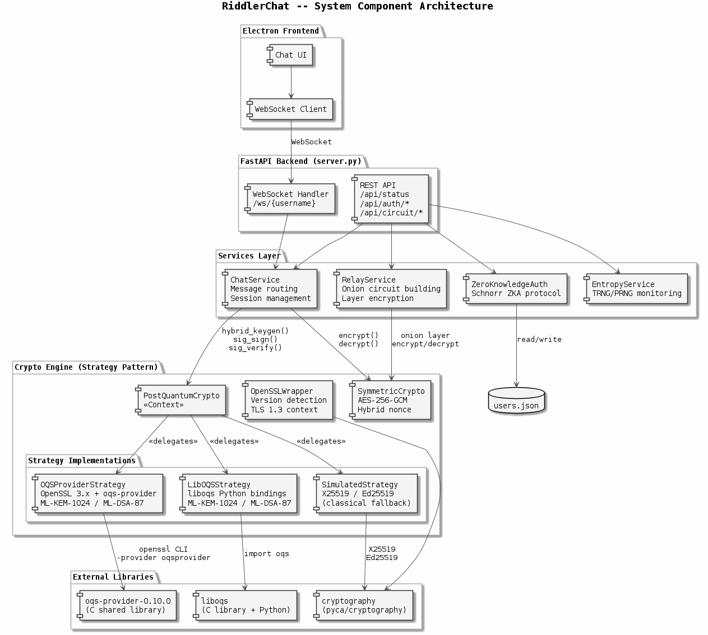
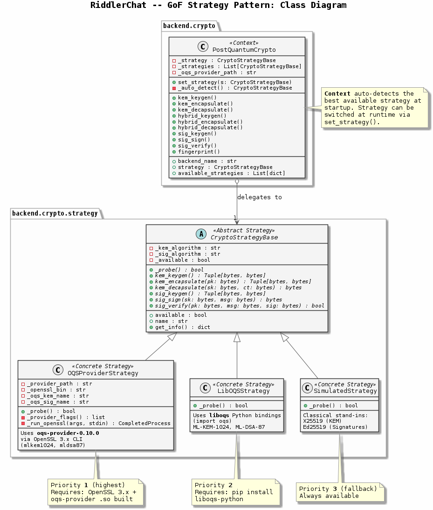
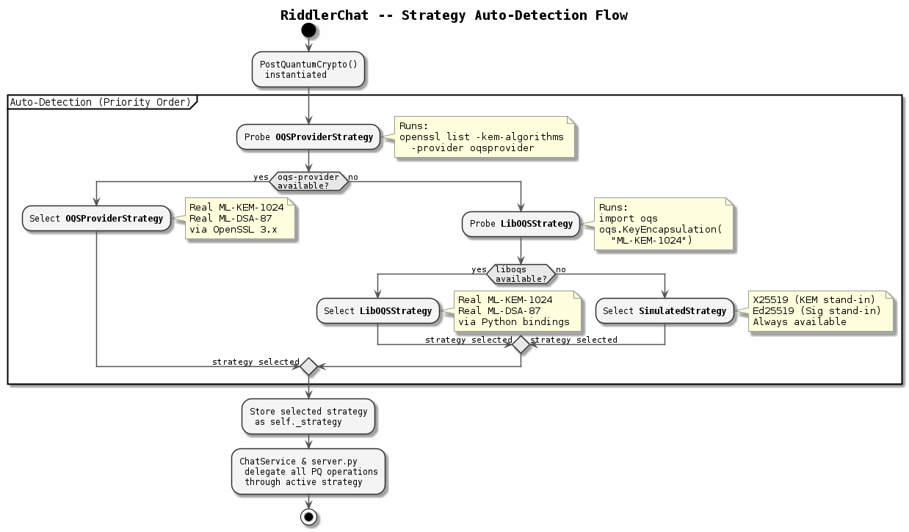
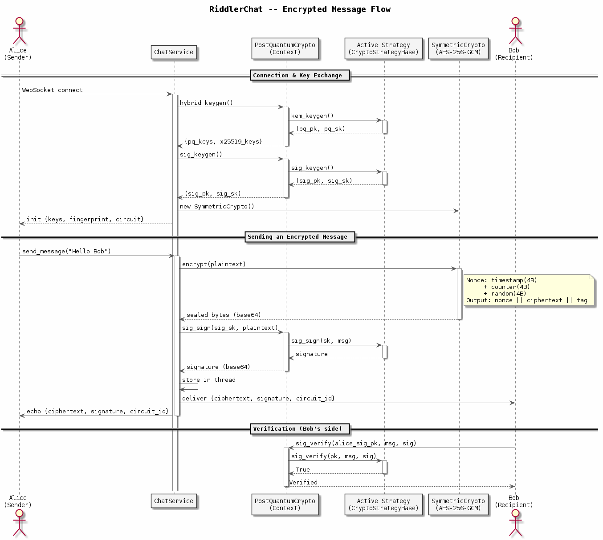
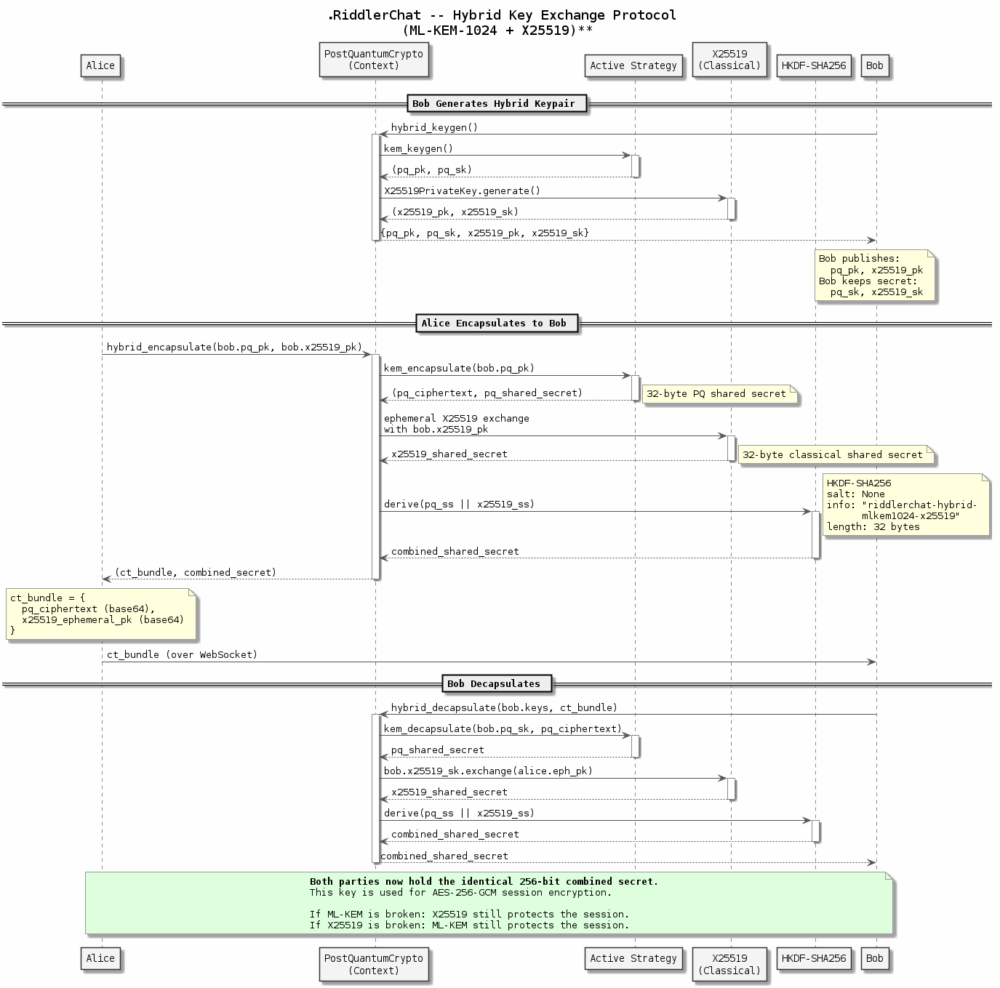

# RiddlerChat Post-Quantum Crypto Strategy Engine

**Oblivion Edge Vulnerability Research LLC, San Antonio, Texas -- June 2026**
**Project: The Riddler Chat System**

---

## Overview

The RiddlerChat backend now features a pluggable post-quantum cryptography engine built on the Gang of Four Strategy design pattern. This architecture allows the system to automatically detect and select the strongest available cryptographic backend at startup, while supporting runtime strategy switching for testing, upgrades, and graceful degradation. The integration brings the Open Quantum Safe (OQS) provider for OpenSSL 3.x directly into the chat application's message pipeline, ensuring that every key exchange, digital signature, and encrypted message can leverage real NIST FIPS 203/204 post-quantum algorithms when the provider is available on the host system.

---

## System Component Architecture

The following diagram shows the full system architecture from the Electron frontend down through the FastAPI backend, services layer, crypto engine, and external libraries. The Strategy Pattern sits at the heart of the crypto engine, with `PostQuantumCrypto` delegating to whichever concrete strategy is active.



The Electron frontend communicates with the FastAPI backend over WebSocket. The backend's services layer -- `ChatService`, `RelayService`, `ZeroKnowledgeAuth`, and `EntropyService` -- handles message routing, onion circuit construction, Schnorr-based authentication, and entropy monitoring respectively. All post-quantum operations flow through the `PostQuantumCrypto` context, which delegates to the active strategy implementation. The strategy in turn calls into the appropriate external library: the oqs-provider C shared library via OpenSSL CLI, the liboqs Python bindings directly, or the pyca/cryptography library for classical fallback.

---

## The Problem

The original `PostQuantumCrypto` class contained all backend detection and algorithm logic inline, using a chain of `if/elif` branches to select between liboqs Python bindings, OpenSSL subprocess calls, and a classical crypto fallback. This monolithic approach made it difficult to add new backends, test individual strategies in isolation, or swap cryptographic implementations at runtime. Integrating the `oqs-provider-0.10.0` C library into this structure would have deepened the coupling and made the code harder to maintain.

## The Solution

We refactored the cryptographic layer using the Gang of Four Strategy pattern, directly inspired by the existing `stateful_messaging` module in the legacy chat client. In that module, `CommunicationBase` defines an abstract interface with `send()`, `recv()`, and `handle_cmd()` methods, while concrete strategies like `PlainTextCOMM` and `SymmetricCryptoMessaging` provide different implementations. We applied the same architectural principle to the cryptographic backend, creating an abstract `CryptoStrategyBase` with concrete strategies for each available provider.

---

## Architecture

The design consists of three layers: an abstract base class defining the contract, three concrete strategy implementations, and a context class that manages strategy selection and delegates all operations. The class diagram below illustrates the complete inheritance hierarchy and delegation relationship.



### Abstract Strategy: `CryptoStrategyBase`

The abstract base class defines seven abstract methods that every cryptographic backend must implement. These cover the full lifecycle of post-quantum key encapsulation (FIPS 203) and digital signatures (FIPS 204). Each strategy also reports its own availability through a `_probe()` method, which the context uses during auto-detection.

```python
class CryptoStrategyBase(ABC):

    @abstractmethod
    def kem_keygen(self) -> Tuple[bytes, bytes]:
        """Generate a KEM keypair. Returns (public_key, secret_key)."""

    @abstractmethod
    def kem_encapsulate(self, public_key: bytes) -> Tuple[bytes, bytes]:
        """Encapsulate a shared secret. Returns (ciphertext, shared_secret)."""

    @abstractmethod
    def kem_decapsulate(self, secret_key: bytes, ciphertext: bytes) -> bytes:
        """Decapsulate to recover the shared secret."""

    @abstractmethod
    def sig_keygen(self) -> Tuple[bytes, bytes]:
        """Generate a signing keypair. Returns (public_key, secret_key)."""

    @abstractmethod
    def sig_sign(self, secret_key: bytes, message: bytes) -> bytes:
        """Sign a message. Returns the signature bytes."""

    @abstractmethod
    def sig_verify(self, public_key: bytes, message: bytes, signature: bytes) -> bool:
        """Verify a signature. Returns True if valid."""
```

### Concrete Strategies

Three concrete strategies implement this interface, each targeting a different cryptographic backend. The system probes them in priority order and selects the first one that reports itself as available.

**OQSProviderStrategy** integrates the `oqs-provider-0.10.0` shared library through OpenSSL 3.x CLI commands. It loads the provider using `-provider oqsprovider` flags and performs real ML-KEM-1024 and ML-DSA-87 operations through `openssl genpkey`, `openssl pkeyutl -encap/-decap`, and `openssl pkeyutl -sign/-verify`. This strategy represents the highest-fidelity post-quantum implementation, using the same C-level provider that powers TLS 1.3 hybrid key exchange in production OpenSSL deployments.

**LibOQSStrategy** uses the liboqs Python bindings (`import oqs`) for direct access to the Open Quantum Safe library. This strategy offers native in-process performance without subprocess overhead, making it ideal for environments where liboqs is installed but the OpenSSL provider is not configured.

**SimulatedStrategy** provides a functional fallback using classical cryptographic primitives from the Python `cryptography` library. X25519 Diffie-Hellman stands in for ML-KEM key encapsulation, and Ed25519 stands in for ML-DSA digital signatures. This strategy is always available and ensures the application remains fully functional during development and testing, even on systems without post-quantum libraries installed.

### Context: `PostQuantumCrypto`

The context class manages strategy lifecycle and delegates all cryptographic operations to the active strategy. It preserves full backward compatibility with the original API, so neither `ChatService`, `server.py`, nor any other consumer required modification.

```python
class PostQuantumCrypto:
    def __init__(self, strategy=None, oqs_provider_path=None):
        if strategy:
            self._strategy = strategy
        else:
            self._strategy = self._auto_detect()  # probe in priority order

    def set_strategy(self, strategy: CryptoStrategyBase):
        """Switch the crypto strategy at runtime."""
        self._strategy = strategy

    def kem_keygen(self):
        return self._strategy.kem_keygen()  # delegated

    def sig_sign(self, secret_key, message):
        return self._strategy.sig_sign(secret_key, message)  # delegated
```

---

## Strategy Auto-Detection

When `PostQuantumCrypto()` is instantiated without an explicit strategy, the context probes each backend in priority order and selects the first one that reports itself as available. The activity diagram below traces this detection flow from instantiation through probe, selection, and delegation.



The auto-detection begins by probing the `OQSProviderStrategy`, which runs `openssl list -kem-algorithms -provider oqsprovider` to check whether the oqs-provider shared library is loaded into OpenSSL. If that probe fails, the system falls through to the `LibOQSStrategy`, which attempts `import oqs` and instantiates a test `KeyEncapsulation` object. If neither post-quantum backend is available, the `SimulatedStrategy` is selected as the final fallback. Once a strategy is chosen, it is stored as the active delegate, and all subsequent calls from `ChatService` and `server.py` flow through it transparently.

| Priority | Strategy | Backend | Probe Method |
|----------|----------|---------|--------------|
| 1 | `OQSProviderStrategy` | OpenSSL 3.x + oqs-provider-0.10.0 | `openssl list -kem-algorithms -provider oqsprovider` |
| 2 | `LibOQSStrategy` | liboqs Python bindings | `import oqs; oqs.KeyEncapsulation("ML-KEM-1024")` |
| 3 | `SimulatedStrategy` | cryptography library (X25519/Ed25519) | Always available |

Once the OQS provider is compiled and installed into the OpenSSL modules path, the system will automatically upgrade to real post-quantum cryptography on the next server restart, with zero code changes required.

---

## How It Connects to the Chat Application

The strategy engine is wired into the live message pipeline at two points. In `server.py`, the module-level `pq_crypto = PostQuantumCrypto()` instance handles user registration, login key generation, and the `/api/status` endpoint. In `ChatService`, the `self.pq = PostQuantumCrypto()` instance handles per-session hybrid key exchange, message signing, and fingerprint generation for every connected WebSocket client.

The following sequence diagram traces the complete message flow from Alice's WebSocket connection through key generation, encryption, signing, delivery, and verification on Bob's side. Every call to the `PostQuantumCrypto` context is visibly delegated to the active strategy.



When a user connects, `ChatService.connect()` calls `self.pq.hybrid_keygen()` to generate an ML-KEM-1024 + X25519 hybrid keypair and `self.pq.sig_keygen()` to generate an ML-DSA-87 signing keypair. When a message is sent, `ChatService.send_message()` encrypts the plaintext with AES-256-GCM using the session key, then signs the original plaintext with `self.pq.sig_sign()`. Every one of these calls flows through the active strategy, which means upgrading from simulated to real post-quantum crypto requires only installing the OQS provider -- no application code changes.

---

## Hybrid Key Exchange Protocol

The hybrid key exchange is the most critical cryptographic operation in RiddlerChat. It combines a post-quantum KEM shared secret with a classical X25519 Diffie-Hellman shared secret, then derives a single combined key through HKDF-SHA256. This dual-algorithm approach provides defense-in-depth: even if one algorithm is broken, the other still protects the session.

The following sequence diagram details every step of the hybrid exchange, from Bob's keypair generation through Alice's encapsulation and Bob's decapsulation, including the HKDF derivation that fuses both shared secrets into a single 256-bit session key.



The protocol proceeds in three phases. First, Bob generates a hybrid keypair by calling `hybrid_keygen()`, which internally invokes the active strategy's `kem_keygen()` for the post-quantum component and generates an X25519 keypair for the classical component. Second, Alice encapsulates to Bob by calling `hybrid_encapsulate()` with Bob's two public keys, producing a PQ ciphertext, an ephemeral X25519 public key, and a combined shared secret derived through HKDF. Third, Bob decapsulates by calling `hybrid_decapsulate()` with his secret keys and Alice's ciphertext bundle, recovering the identical combined secret. Both parties now hold the same 256-bit key, which becomes the AES-256-GCM session encryption key.

---

## Live Cryptographic Output

The following output was captured from a live execution of the RiddlerChat crypto engine. Each value shown is real cryptographic material generated during the session.

### Key Encapsulation (ML-KEM-1024 Interface)

The KEM keygen produces a keypair, encapsulation creates a ciphertext and shared secret using the public key, and decapsulation recovers the identical shared secret using the secret key.

```
KEM Keygen:
  Public Key  (32 bytes): 16779b17e774eb5389fb16fdb5e6da0bfc09b9c7...
  Secret Key  (32 bytes): 1096e61ac382abe243d8b372b44baf0286a0ed0c...

Encapsulate (using Public Key):
  Ciphertext     (32 bytes): e3107f2cd7f66324d7be19b34902426f35...
  Shared Secret  (32 bytes): 98727969cf3546cdab596504abaf29905663ee33...

Decapsulate (using Secret Key + Ciphertext):
  Recovered Secret (32 bytes): 98727969cf3546cdab596504abaf29905663ee33...
  Secrets Match: True
```

Both parties now hold the same 256-bit shared secret without ever transmitting it over the wire. This secret becomes the AES-256-GCM session key.

### Hybrid Key Exchange (ML-KEM-1024 + X25519)

```
Hybrid Keygen:
  PQ Public Key     (32 bytes): 8dcff2d90a458da06ad7ed6a9a053970...
  X25519 Public Key (32 bytes): 4a926c041722c04052506cabbe4948c642...
  Combined Secret   (32 bytes): ec6bea754beb4a4c1841b4a7eec7e335...
  Fingerprint: 2BDB·3595·2EFA
```

### Digital Signature (ML-DSA-87 Interface)

The signing keypair is generated once per session. Every outgoing message is signed with the secret key, and the recipient verifies using the sender's public key. A tampered message or forged signature returns `False`.

```
Message:    Riddle me this: What has a head and a tail but no body? A coin.
Signature:  299cd92e80be1c94bcd996f7be04f56ed56dbf4e370e939f14f2...
Verified:   True
```

### AES-256-GCM Authenticated Encryption

The combined shared secret from the hybrid exchange serves as the encryption key. Each message is sealed with a unique 96-bit hybrid nonce (timestamp + counter + random) to prevent nonce reuse, even under clock skew or high message rates.

```
Plaintext:   The Riddler has entered the chat. All circuits are sealed.
Key:         ec6bea754beb4a4c1841b4a7eec7e33593c348243f2e0d47b3c15236f902373c

Sealed (86 bytes):
  Nonce (12B):      6a4020ce 00000000 71dfe01e
                    [timestamp] [counter] [random]
  Ciphertext (74B): 3e91ac2be7a8fb0bedb0b3b5463a1aeb05b5bc9451857f17
                    cd280392646065d26d63fc0dc508599fa3c45ffee4459f07
                    8e69f6da0483bcafd3b42d282208d4aa7fc19f5ec36537f0
                    1147

Decrypted:   The Riddler has entered the chat. All circuits are sealed.
Match:       True
```

The ciphertext is indistinguishable from random data. Any modification to the nonce, ciphertext body, or authentication tag causes decryption to fail with an `InvalidTag` exception, providing tamper evidence on every message.

---

## Test Coverage

The implementation ships with 77 pytest tests organized across four test modules covering unit, functional, security, and integration concerns.

**Strategy Pattern Unit Tests (26 tests)** verify that the abstract base class cannot be instantiated, all three concrete strategies implement the full interface, auto-detection selects the best available backend, and runtime strategy switching works correctly.

**Functional Tests (17 tests)** exercise complete cryptographic roundtrips: KEM keygen-encapsulate-decapsulate, hybrid ML-KEM + X25519 key exchange, ML-DSA sign-verify cycles, AES-256-GCM encrypt-decrypt with and without additional authenticated data, and a full end-to-end message flow simulating Alice sending an encrypted, signed message to Bob.

**Security Tests (24 tests)** validate tamper detection on ciphertext, nonces, AAD, and signatures. They confirm key isolation between sessions, verify that nonces contain timestamp, counter, and random components, test that rekeying provides forward secrecy by invalidating old ciphertexts, and assert sufficient entropy across 100 generated keys.

**OQS Provider Integration Tests (10 tests)** exercise real ML-KEM-1024 and ML-DSA-87 operations through the OQS provider when it is built and available on the system. These tests automatically skip on systems where the provider is not installed.

```
67 passed, 10 skipped in 0.56s

Coverage:
  pq_crypto.py (Context):       98%
  simulated_strategy.py:        96%
  symmetric.py:                100%
  crypto_strategy_base.py:      81%
```

---

## File Manifest

| File | Role |
|------|------|
| `crypto/strategy/crypto_strategy_base.py` | Abstract base class (7 abstract methods) |
| `crypto/strategy/oqs_provider_strategy.py` | OQS provider via OpenSSL 3.x CLI |
| `crypto/strategy/liboqs_strategy.py` | Direct liboqs Python bindings |
| `crypto/strategy/simulated_strategy.py` | X25519 / Ed25519 classical fallback |
| `crypto/pq_crypto.py` | Strategy Context with auto-detection and runtime switching |
| `tests/test_strategy_pattern.py` | 26 unit tests for pattern compliance |
| `tests/test_crypto_functional.py` | 17 functional roundtrip tests |
| `tests/test_security.py` | 24 security and tamper detection tests |
| `tests/test_oqs_provider_integration.py` | 10 integration tests (auto-skip) |

---

*1337_TECH DBA -- "Every riddle has an answer. Every message has a seal."*
